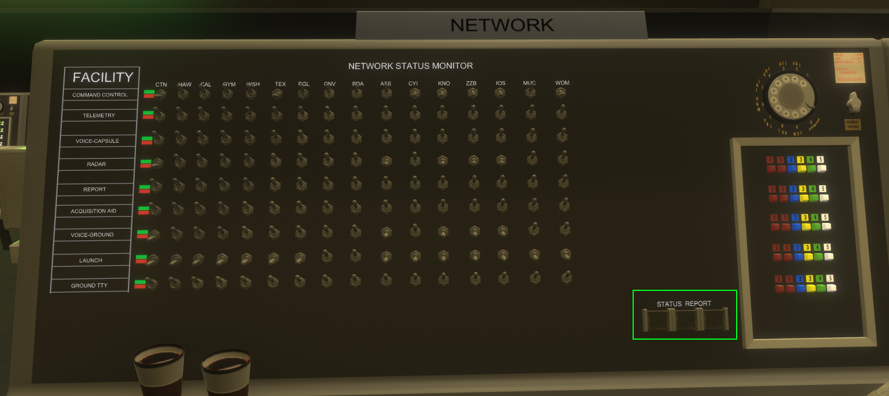

# Reentry Mercury Mission Control Center
Manual version 0.67.0.2-git

This manual isn't necessarily realistic, and is not crew-rated.

## Information for the pilot

Upon entering the capsule, press Escape, then Mission Control Live, change the server name etc, and optionally your name, press create room. When the log says "room created", you can press escape again.

## When you enter MCC
When you enter, you will be looking at the capsule communicator position. For the benefit of this manual, we'll start-out with the CAPCOM-role, since that's where you'll be dropped by default.

First, in the white rectangle, you'll see your sign. Whenever you're in a seat, the sign will tell you which seat you're in. Additionally, your position will show up in the chat.

Second, in the green rectangle, you'll see your status-indicator. This is how you indicate to the flight-controller if you're ready to proceed or not. By default, none of the buttons will be lit. Pressing an unlit button changes the status of the seat. Pressing a lit button turns off the status-report, which can be used to indicate that the seat is vacant. It's recommended that a crewed station is set to amber(yellow, center) outside of GO/NOGO-calls. If something isn't GO on your station, change it to red and call out reason in chat (more on that later).

Most things are unique to each station. One of these things is the mission state indicator (red rectangle). This is used to tell you where in the mission you are.

The purple rectangle shows you the current Mission Elapsed Time (MET) and Greenwich Mean Time (GMT). MET shows you how long it is since the launch.

The buttons in the blue rectangle is used to select camera for the screen in the yellow rectangle. This is used to watch the launch.

If you want to stay in the CAPCOM-position, please select it in the view-menu so that you're properly seated. If the view-menu isn't visible to you, press V.

If you look around, you may see the avatars of others. Above the avatars, you'll see their usernames. If you're overlapping with someone, you'll not see them. You can customize your avatar in the profile-part of the game settings-menu.

It's recommended that the first person to enter MCC temporarily switches to the Flight Director-position to temporarily halt the countdown. See [Flight Director](#f5-flight-director) to see how.

### Intercom and radio-messages

If you do not have the intercom and radio-messages open, press C. The buttons in the red rectangle allow you to select which rooms you receive messages from, and you can "listen"
to both rooms at the same time if you want. In this example, the user is receiving messages from the mission control room only. Radio-messages are color-coded so you know which room they're from, with blue for messages in the mission-control room. You'll also notice that the messages also indicate the then-current position of the person. The buttons in the green rectangle allows you to select which room you're sending a message to. Historically, you'd listen to multiple rooms but only speak to capsule if you're CAPCOM, but in MCL that's up to you.

On the other hand, if "radio messages" is setup like this, with both "ROOM" and
"CAPSULE" colored, you'll receive messages for both the MCC and capsule.

## Controls

(Assuming default controls) Arrow-keys are used to walk around without changing seat. Holding the middle mouse button lets you pitch and yaw the view, scroll wheel zooms.

F1-11 lets you change to some of the views, a list of views is available if you press V, and a chat-window is viewable if you press C.

To trigger the failure-menu, press CTRL+T.

It's advised that you bind chat send to ENTER.

## Views
### (F3) Globe
### (F5) Flight Director

The flight-director mission-status (green rectangle) is special. It doesn't have an amber button (because if the flight-director doesn't know if they're there you've got bigger problems), and when you press the red button pre-launch you can halt the countdown.

The red rectangle marks where the flight-director sees the status of each of the seats. In this case, all the seats were unoccupied and so all the lights are unlit. In case of an abort, the flight-director presses the abort-button (purple rectangle), which lights the abort-light in the capsule.

Above you see what the status indicators look like to the flight-director, with both CAPCOM and SYSTEMS present.

### (F6) CAPsule COMmunicator (CAPCOM)

The CAPCOM is in charge of communicating with the capsule. Realistically, CAPCOM is the only person directly communicating with the capsule, everyone else talks to the capsule through them. CAPCOM can see the current progress of the flight, as well as having a monitor for seeing the launch-pad. 

### (F7) Spacecraft SYSTEMS (SYSTEMS)

SYSTEMS is in charge of monitoring the spacecraft fuel and electrical systems, as well as the attitudes and the rate of change in the individual rotational axes. SYSTEMS shares the responsibility for consumables with [ENVIRONMENT](#f8-spacecraft-environment-environment).

In case of an indicator failure aboard the spacecraft, SYSTEMS becomes especially important, as the pilot has to fly partially blind otherwise. To verify indicator functionality, have both SYSTEMS and the pilot give a readout.

### (F8) Spacecraft ENVIRONMENT (ENVIRONMENT)

ENVIRONMENT is the other half of the consumables, and is in charge of monitoring the primary and secondary O2 tanks, as well as the pressure and temperature of the cabin and suit.

### (F9) Flight Dynamics Officer (FDO/FIDO)

FIDO is in charge of monitoring the orbital parameters of the spacecraft.

### RETROfire controller (RETRO)

RETRO is in charge of getting the spacecraft down. If the mission has to be aborted in orbit, it's up to RETRO to reschedule the retrofire-time. This is done by increasing or decreasing the MET timestamp (hours, minutes, and seconds). To do this, RETRO pushes the buttons above (to increase) and below (to decrease), until they reach the wanted retro-time, then press SET to set it.

### Network (NETWORK)

NETWORK is in chargee of managing the communications-network. If Australia out lacks the paper to run their teletype, and CAL lost their radar, it's up to NETWORK to make sure that's shown on the mains. This position is sometimes used by MCC-users humorously write or draw various things on the board.

### Missile TELEMETRY (TELEMETRY)

TELEMETRY is in charge of monitoring the ascent and state of of the booster, making sure the capsule safely gets into space (before vacating the seat). During launch, this means monitoring the pressure of the various chambers, as well as the velocities and altitude of the missile.

### Range Safety Observer (RSO)
Effectively INOP

### SUPPORT Control Coordinator (SUPPORT)
Effectively INOP

### Flight SURGEON (SURGEON)
Effectively INOP

### RECOVERY

Monitors above height sea-level for recovery.